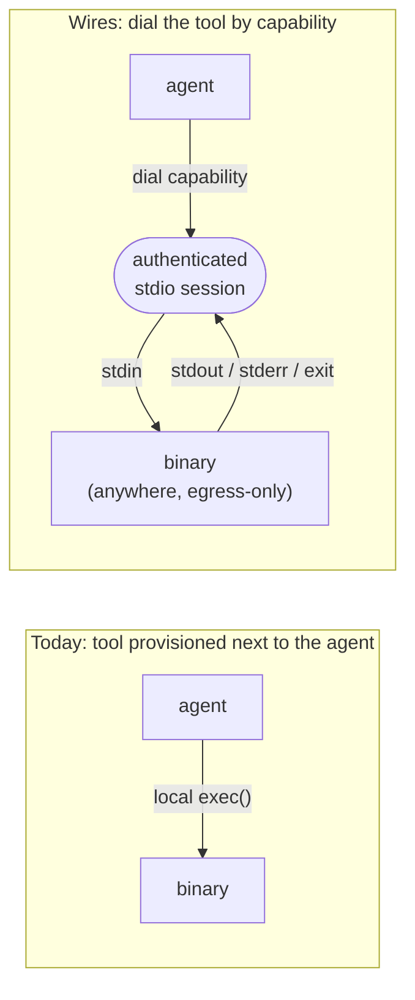
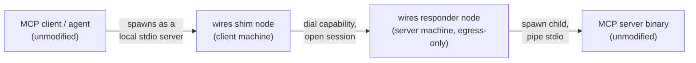
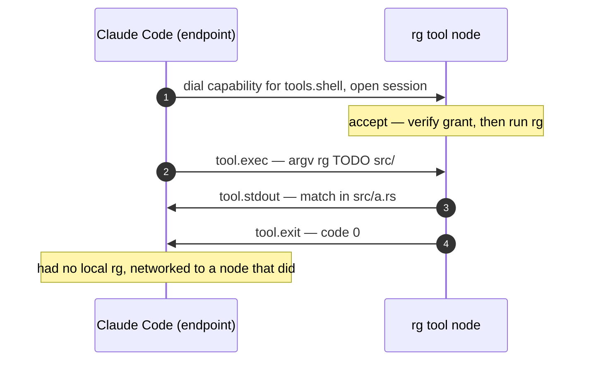

# Wires

    # This is executable Markdown that's tested on CI.
    # How is that possible? See https://gist.github.com/bwoods/1c25cb7723a06a076c2152a2781d4d49
    set -o errexit -o nounset -o xtrace
    alias ~~~=":<<'~~~sh'";:<<'~~~sh'

## Setup dev environment

First, we recommend you setup a Bazel-based developer environment with homebrew.

1. Run `make setup`

This will install `bazelisk` and `direnv` and add all the bazel-controlled tools to the path in this directory.

### Try it out

TODO

# Wires as a session layer: stdio and MCP over a capability-addressed network

The clever core of wires is one idea: **a capability-addressed transport
whose native protocol data unit is stdio — and, one frame up, MCP.** This
document is just that idea and the two reference protocols that sit on it
(stdio-over-wires and MCP-over-wires). It deliberately leaves out the
fabric / gossip / retention machinery that lives elsewhere in the repo;
that's a separate concern and it only obscures the layer.

> **Status: conceptual.** The pieces this builds on (identity-addressed,
> NAT-traversing iroh streams and the human-rooted capability model) exist
> today; `wires-ha` is the working example of the node shape. The
> stdio/MCP session framing described here is the reference *protocol* on
> the layer, marked where it is a convention to build rather than a
> guarantee.

## The thesis

Every networking layer is defined by two choices: **what is the address,
and what is the protocol data unit (PDU).** Those two answers are what
make TCP "TCP" and HTTP "HTTP". For wires:

- **The address is a capability**, not an `(IP, port)`. You do not dial a
  *host*; you dial *a tool you have been granted the right to use*,
  identified by key and scoped by a non-transferable, human-issued grant.
- **The PDU is a stdio stream** (stdin / stdout / stderr / exit), and one
  frame up, an MCP message. The link's *native* content is exactly what
  agents and tools already speak.

That second choice is the move. Most systems treat stdio and MCP as
*application payload you happen to ship over a generic transport*. Wires
makes them the **native framing of a link layer**, so "networking a tool"
and "speaking to a tool" become the same act — there is no impedance
mismatch to bridge, because the wire already speaks pipes.

The one-line form:

> **Wires is the missing session layer of the agent stack: a
> capability-addressed, identity-bound transport whose native PDU is
> stdio and MCP. It makes any binary's stdin/stdout a first-class,
> location-independent network endpoint usable only by whoever you grant —
> turning "provision the tool next to the agent" into "dial the tool by
> capability, wherever it runs."**

## Where it sits in the stack

Walk the existing stack and the gap is precise:

| Layer                 | Address             | Credential                               | What you get                             | Gap for agent tooling                                   |
| ----------------------- | --------------------- | ------------------------------------------ | ------------------------------------------ | --------------------------------------------------------- |
| TCP/IP                | `(IP, port)`        | none                                     | byte pipe                                | no identity, location-bound                             |
| TLS                   | `(IP, port)` + cert | CA chain                                 | encrypted byte pipe                      | identity bolted on, still location-bound                |
| SSH                   | reachable IP        | copyable keypair (bearer)                | authenticated remote shell               | coarse (a whole shell), bearer auth, needs reachability |
| WireGuard / Tailscale | overlay IP          | device key                               | an IP network                            | still L3 — you then run protocols on top               |
| **wires**             | **a capability**    | **non-transferable, human-issued grant** | **an authenticated stdio / MCP session** | — this is the layer                                    |

Nothing above wires lets you say: *"this binary's stdin/stdout is now a
first-class network endpoint, addressable by a capability, reachable
wherever it runs, usable only by whoever I admitted."* That sentence is
the layer. It is SSH where the address is a capability instead of an IP,
the credential is an identity-bound grant instead of a copyable key, and
the far end is a scoped tool instead of a shell.

## The core: dial a capability, get a stream, speak stdio

The novel part wires actually has to add is small. iroh already provides
dial-by-key, NAT-traversing, encrypted, multiplexed QUIC streams. On top
of that, the session layer is:

> **an ALPN meaning "open a capability-scoped stdio/MCP session," plus
> the human-rooted, non-transferable capability model that decides who
> may dial what.**

A tool call is a **session**, not a broadcast: open → stream
stdin/stdout/stderr → close. No persisted log, no gossip, no retention is
required for that to be true.

The binary is unchanged and unaware of wires. It reads stdin and writes
stdout/stderr exactly as always. The wrapper node is the adapter between
"process I/O" and "the session," and it owns the only new thing: an
identity, and the capability that says which channel/peer may drive it.

## Reference protocol 1: stdio-over-wires

A stdio tool node maps process I/O directly onto the session. The frames
(this is the *reference convention*, not a substrate rule):

| Direction     | Process concept | Frame                                                          |
| --------------- | ----------------- | ---------------------------------------------------------------- |
| agent → tool | argv + stdin    | `tool.exec` (argv, optional stdin) / `tool.stdin` (more input) |
| tool → agent | stdout          | `tool.stdout` (chunk)                                          |
| tool → agent | stderr          | `tool.stderr` (chunk)                                          |
| tool → agent | exit code       | `tool.exit` (code)                                             |

Every frame still carries the substrate's mandatory human-readable
summary alongside its structured body, so a consumer that has never seen
this tool's schema can still act on plain text ("exited 0", "3 matches")
and graduate to parsing structure once it has learned the surface.

Three interaction shapes fall out of the same session primitive:

- **One-shot** (`rg`, `git status`): one `tool.exec` in; a few
  `tool.stdout`/`tool.stderr` frames and a `tool.exit` out; stream closes.
- **Streaming** (`tail -f`, a build with progress): the tool keeps
  emitting `tool.stdout` as output arrives; the agent sees it live.
- **Interactive / long-running** (a REPL, a shell-like session): the
  agent feeds further `tool.stdin` while the process stays alive; a
  correlation id ties a stream of frames to one process instance.

Because CLIs are self-documenting, discovery needs no registry: an agent
dials the tool and runs `--help` to learn the surface, then uses it
directly. The project intends to publish a standard stdio-over-wires
frame format so tools and agents interoperate without negotiating — a
convention on the layer, not part of it.

## Reference protocol 2: MCP-over-wires

This is the cleanest proof the thesis sits at the right layer. An MCP
server is normally a **local binary** that the MCP client spawns as a
child process and talks to over stdio (JSON-RPC framed on stdin/stdout).
Because the wires session's native PDU *is* stdio, you can relocate that
binary to another machine and **MCP never notices** — no remote-transport
story to invent, no HTTP/SSE/OAuth bolt-on.

### What actually runs on each machine

Two thin wires nodes bracket the existing, unmodified pieces. Nothing
about the MCP client or the MCP server changes.

- On the **server machine** (e.g. inside a VPC): a wires **responder**
  node. It holds an identity and an installed grant, binds an iroh
  endpoint (egress-only, dialable by key, *no inbound port*), and listens
  on the session ALPN. On an inbound capability-scoped session it verifies
  the caller's grant, spawns the MCP server binary as a child process, and
  bridges the iroh stream byte-for-byte to the child's stdin/stdout/stderr.
- On the **client machine** (where the agent runs): a wires **shim** node.
  The MCP client spawns it exactly as it would spawn a local stdio MCP
  server. The shim holds the capability to dial the remote, opens a
  session, and pipes its own stdin/stdout to the iroh stream.

The MCP client believes it launched a local stdio server; the MCP server
believes it was launched locally by a client. Neither is aware of the
network between them. wires carries the JSON-RPC bytes opaquely — it never
parses MCP.

### What has to exist on the server machine

- the **MCP server binary** and everything it needs to do its job
  *locally* — its config and its secrets. The database password, API key,
  or service credential an MCP server uses **stays on that machine and
  never travels to the agent**; the agent only ever holds a capability to
  *reach* the server, not the secrets the server wields.
- the **wires responder binary** with a grant installed (issued once via
  the pairing flow).
- **outbound network egress** to reach a relay / rendezvous. No inbound
  ports, no public endpoint, no TLS certificate, no MCP-side auth layer.

### Why this is the right framing

This is essentially `ssh user@host -- mcp-server`, with the three
differences that make it a *layer* rather than a workaround: the address
is a **capability** instead of a reachable IP, the credential is a
**non-transferable identity-bound grant** instead of a copyable key, and
the exposure is scoped to **exactly that one binary** instead of a shell.
Your "local" MCP server now runs in a VPC, an air-gapped enclave, or on
another machine — and the MCP spec did not change at all.

MCP-over-wires as described here carries  an MCP *server's* stdio across
the session layer — and is the conceptual reference protocol, not a
shipped component.

## Agents like Claude Code are just endpoints

An agent is not special transport; it is another endpoint on the layer.
Claude Code stops being the box that *contains* its tools and becomes a
peer that **dials tools by capability.** Its right to drive a tool is the
grant it holds, not shell access, not a bundled binary, not an API key in
its environment.

## What the layer gives you for free

These are properties of the session layer itself — the agent and the tool
implement none of them:

- **Identity on every session.** The session is authenticated to the
  caller's key. The tool knows *which* endpoint is driving it,
  cryptographically — never "whoever reached the socket."
- **Authorization is the address.** You can only dial a capability you
  hold. There is no separate auth layer in the tool; its access policy
  *is* who you granted the capability to.
- **Non-transferable, human-issued grants.** Authority is bound to an
  endpoint's key and rooted in one human's key. It cannot be copied or
  subleased the way an SSH key or API token can.
- **Instant revocation.** Withdraw the grant and the endpoint can no
  longer dial. No key rotation across every place a secret was cached.
- **End-to-end encryption + NAT traversal**, inherited from iroh: the
  tool is reachable egress-only, with no public endpoint, and the stream
  is encrypted between the two endpoints.
- **Multi-party as session fan-out.** Several agents — and a human
  watching — can attach to one tool session as additional observers of the
  same stream.

## Layer vs. convention

To keep the line clear:

- **Layer (the invention):** capability addressing, identity-bound
  non-transferable grants, the dial-a-capability-get-a-stdio-session
  ALPN, end-to-end encryption and NAT traversal via iroh.
- **Reference protocols (conventions on the layer):** the stdio-over-wires
  frame vocabulary (`tool.exec` / `tool.stdout` / `tool.stderr` /
  `tool.exit`, correlation ids), and MCP-over-wires (MCP's own JSON-RPC
  carried byte-for-byte on a stdio session). Two endpoints may negotiate
  something else; the layer does not care what flows on the session.

The point of the split is that you build identity, capability
authorization, encryption, and NAT traversal **once**, as a layer — and
then "make any stdin/stdout a secure, networked, revocable endpoint" and
"make a local MCP server remote" are both *reference protocols on that
layer*, not new protocols.
