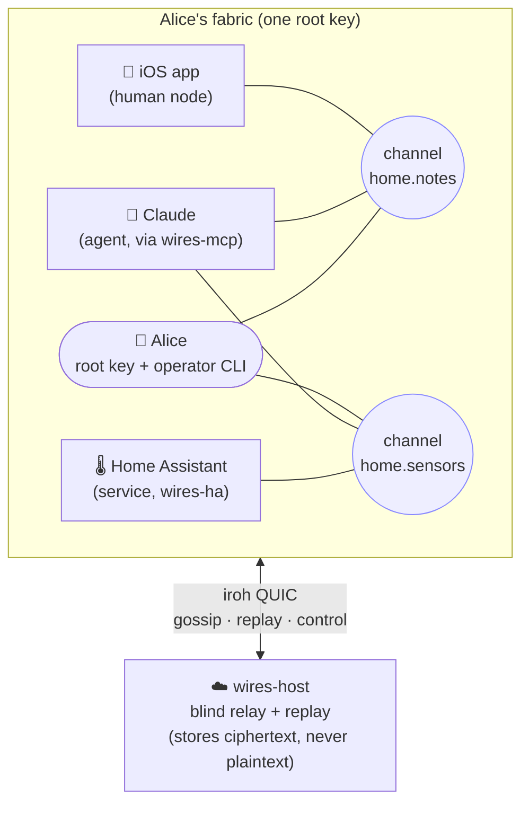
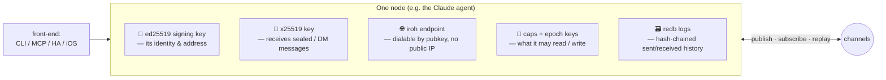
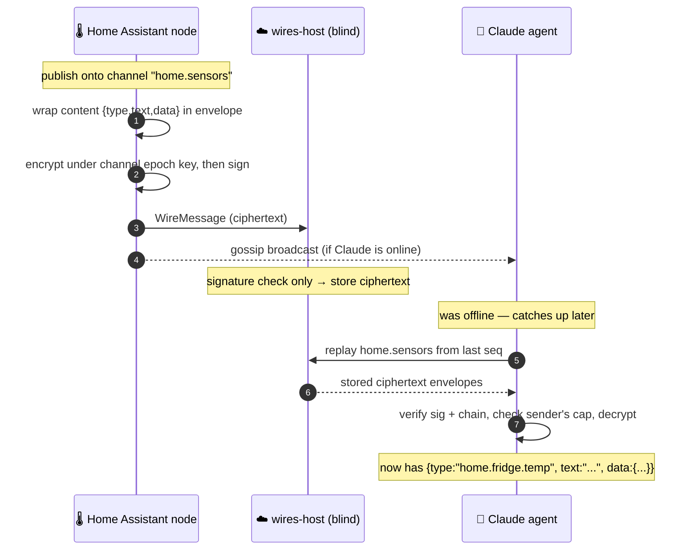
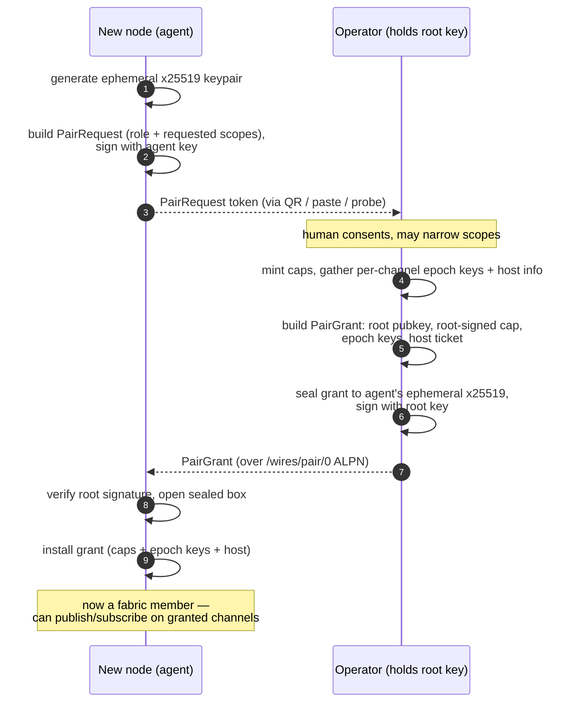

# wires

End-to-end encrypted gossip substrate for a fabric — your network of
agents, services, and devices, rooted in your identity. Think "a
private group chat that machines can read and write to, hosted by a
server that cannot."

For the conceptual model — what a fabric is, how nodes join, the
two-layer authorization scheme, and the substrate-vs-protocol stance —
see [`docs/tech_overview.md`](docs/tech_overview.md). For a multi-agent
operator tour, see [`docs/quickstart.md`](docs/quickstart.md).

## Status

Prototype. Landed on `main`:

- **Substrate v1** — identity, topics, capabilities, encrypted
  publish/subscribe, replay between peers, persisted hash-chained logs.
  Drives the CLI end-to-end. Spec:
  [`substrate-design`](docs/superpowers/specs/2026-05-14-wires-substrate-design.md).
- **Hosted service v1** — `wires-host` is a multi-fabric blind relay
  with a `/wires/fabric/0` control-plane ALPN, per-fabric rolling
  retention, and a base64 `HostTicket` discovery surface. Spec:
  [`hosted-service-design`](docs/superpowers/specs/2026-05-14-wires-hosted-service-design.md).
- **Responder-driven pairing v1** — agents declare a role + requested
  scopes via `wires pair-listen`; the operator consents and dials in
  via `wires pair-approve` over `/wires/pair/0` with a sealed, signed
  `PairGrant`. Spec:
  [`responder-driven-pairing-design`](docs/superpowers/specs/2026-05-15-wires-responder-driven-pairing-design.md).
- **MCP gateway v1** — `wires-mcp` is a multi-fabric authenticated MCP
  gateway. OAuth 2.1 (PRM + AS + DCR) with iOS as a universal
  authenticator, single-QR consent dispatch, and per-user TTL +
  byte-budget retention (defaults: 1 h / 50 MiB). Specs:
  [gateway](docs/superpowers/specs/2026-05-18-wires-mcp-gateway-design.md),
  [retention](docs/superpowers/specs/2026-05-18-wires-mcp-retention-design.md).
  Operator setup: [`docs/mcp-gateway.md`](docs/mcp-gateway.md).
- **Channels v1** — named (operator-introduced, persistent name) and
  DM (DH-derived, zero-setup) channels share one wire vocabulary, one
  cap glob (`channels.**`), and one `ChannelView` fold. Spec:
  [`channels-design`](docs/superpowers/specs/2026-05-21-wires-channels-design.md).
- **iOS companion (HIG redesign v1)** — Apple-HIG-aligned UI for
  onboarding, network management, and consent, exercised by a 26-fixture
  XCUITest snapshot harness. Live UniFFI bridge to the wires substrate
  is pending; today the app renders against fixture clients. Spec:
  [`ios-hig-redesign-design`](docs/superpowers/specs/2026-05-19-wires-ios-hig-redesign-design.md).

A working Home Assistant ingestion daemon (`wires-ha`) ships as a
separate binary and is the canonical example of a non-CLI agent
participating in gossip + replay.

## How it works

### The core idea: a missing layer of the stack

The clever part of wires is not the encrypted group chat — it's a layer
of the networking stack that's been missing for the agent era. Every
networking layer is defined by two choices: *what is the address, and
what is the protocol data unit (PDU)?* For wires:

- **The address is a capability**, not an `(IP, port)`. You don't dial a
  host; you dial *a tool or peer you've been granted the right to reach*,
  identified by key and scoped by a non-transferable, human-issued grant.
- **The native PDU is a stdio stream** (stdin / stdout / stderr / exit) —
  and one frame up, **MCP**. The things agents and tools already speak are
  the link's native content, not application payload bolted on top.

That makes "networking a tool" and "speaking to a tool" the same act. It's
SSH where the address is a capability instead of an IP, the credential is
an identity-bound grant instead of a copyable key, and the far end is a
scoped tool instead of a raw shell. A local stdio MCP server becomes a
*networked* MCP server for free, because the layer already speaks stdio.
The full argument — and the two reference protocols (stdio-over-wires and
MCP-over-wires) — is in
[`docs/tools-over-wires.md`](docs/tools-over-wires.md).

Everything below describes the prototype that implements this. One note up
front: the **gossip + retention + replay** machinery you'll see is an
*optional durability tier* (for audit-at-rest and offline/async delivery),
not the core of the layer — a live capability-to-tool session needs none
of it.

### What a network looks like

A **fabric** is one person's private network. It is rooted in a single
human who holds an ed25519 **root key**, and populated by **nodes** — the
agents, services, and devices that person has authorized. Nodes don't
connect to each other directly by name; they meet inside **channels**.
The diagram below is a typical small fabric: a few nodes, two channels
they share, and a blind host providing the optional durability tier.



A node is a member of a channel only if (a) it holds a root-signed
**fabric grant** putting its key in the fabric, *and* (b) it is in that
channel's roster with the current **epoch key**. Both layers must hold to
read or write. The host enforces *neither* — it only checks signatures
and routes ciphertext. Every real authorization check happens on the
*receiving* node at decrypt time.

### What a node actually is

A node is just a process with a data directory. The CLI, the MCP gateway,
the HA daemon, and the iOS app are all the same thing wearing different
front-ends. Inside, every node holds the same set of pieces:



The node's public key *is* its address: iroh lets any peer dial it by key
with no port-forwarding or public IP. Its caps and epoch keys decide
which channels it can touch; its logs are a per-publisher hash chain so
history is tamper-evident and replayable.

### What gets sent on a channel, and how it travels

Two communication shapes ride the same identity + capability foundation.
The **session** shape is the core of the layer: an endpoint dials a
capability and gets an authenticated, encrypted stdio/MCP stream (see
[`docs/tools-over-wires.md`](docs/tools-over-wires.md)). The **publish /
subscribe** shape described here is the durability tier: a node publishes
a message onto a channel; every other node in that channel's roster
receives it — by live **gossip** if they're online, or by **replay** from
the host when they next come online. Sender and receiver never have to be
online at the same time. This is what the prototype implements end-to-end
today, and what powers audit-at-rest and offline catch-up.

The thing on the wire is a signed, encrypted `WireMessage` envelope. Its
decrypted body is a small canonical-JSON object — this is the *entire*
payload contract Wires imposes:

```jsonc
{
  "type": "home.fridge.temp",   // dotted namespace; meaning is up to participants
  "text": "fridge is now 4°C",  // MANDATORY natural-language summary
  "data": { "celsius": 4 }       // OPTIONAL structured payload for machines
}
```

The mandatory `text` field is the key design choice: because at least one
party to most exchanges understands language, every message is legible
even when no shared schema exists. Two agents can negotiate richer `data`
schemas at runtime. Wires itself only interprets reserved `__`-prefixed
types (`__cap.grant`, `__cap.revoke`, roster ops); everything else is
opaque substrate.



### How a node joins: responder-driven pairing

A node never logs in with a password. It announces the role and scopes it
wants; the human operator (holding the root key) consents and seals a
root-signed grant back to it. This one flow is behind the CLI's
`pair-listen` / `pair-approve` and the iOS single-QR consent screen.



Not built yet: live iOS bridge to the wires substrate, `__cap.*`
gossip propagation, `__topic.epoch_advance` distribution,
operator-initiated DM from a paired-agent's perspective (the
`PairGrant` doesn't yet carry the operator's x25519 pubkey).

## Build

Requires stable Rust (tested on 1.95).

```bash
cargo build --release
```

Three binaries land in `target/release/`:

- **`wires`** — the agent/human CLI. One data directory per agent.
- **`wires-host`** — a multi-fabric blind relay/replay server. Holds
  no fabric keys; persists ciphertext only for fabrics and topics
  registered via the fabric control protocol.
- **`wires-ha`** — Home Assistant ingestion daemon. Subscribes to a
  HA WebSocket and publishes `state_changed` events onto a configured
  wires topic.

For the demo below it's convenient to also
`cargo install --path crates/wires-cli` and
`cargo install --path crates/wires-host` so `wires` and `wires-host`
are on your `$PATH`.

## Hello, world

Two terminals. The first runs a host; the second runs an operator
("Alice") who creates a topic, publishes a message, and reads it back.

```bash
# Terminal 1 — host
mkdir -p ./host
RUST_LOG=info wires-host --data-dir ./host
# → INFO wires_host: host ticket: <TICKET_BASE64>
```

```bash
# Terminal 2 — operator
TICKET=$(wires-host --data-dir ./host ticket --no-qr)

wires --data-dir ./alice init --new-root
wires --data-dir ./alice host pair --ticket "$TICKET"

wires --data-dir ./alice topic create home.notes
# → Minted self-cap: <CAP_HEX>      ← copy this hex
wires --data-dir ./alice host topic-register home.notes

wires --data-dir ./alice publish \
  --topic home.notes --cap <CAP_HEX> \
  --type agent.note "hello"

wires --data-dir ./alice cat home.notes
# → 2026-05-21 ... <ALICE_PREFIX> 0 | agent.note :: hello
```

For the full multi-agent walkthrough — pairing a second agent, gossip
between live peers, channels and DMs, observing the host's on-disk
state, killing the host and watching replay catch up — see
[`docs/quickstart.md`](docs/quickstart.md).

## Layout

```
crates/
  wires-core    pure types (WireMessage, Capability, content, sign/verify) + channel layer (ChannelView, derivation, replay fold)
  wires-crypto  AEAD (chacha20-poly1305), sealed-box (x25519), public envelopes
  wires-store   redb-backed hash-chained logs, cap table, epoch keys, ingest index
  wires-net     iroh gossip + replay protocol + fabric control protocol + pair protocol + host ticket
  wires-node    Node runtime (publish, inbound, sync, NetGlue, NodeRuntime) + channel I/O (open_named, open_dm, shared helpers for CLI/MCP)
  wires-cli     `wires` binary (init/host/topic/publish/cat/pair-* plus channel/dm/me)
  wires-host    `wires-host` multi-fabric relay (lib + bin: fabric registry, retention, routing, host-ticket emission)
  wires-ha      `wires-ha` Home Assistant ingestion daemon
  wires-mcp     `wires-mcp` authenticated MCP gateway (lib + bin: OAuth 2.1, per-user NodeRuntime, MCP tools)
docs/
  tech_overview.md       conceptual overview
  quickstart.md          end-to-end CLI walkthrough
  mcp-gateway.md         wires-mcp operator + user walkthroughs
  superpowers/specs/     design docs (substrate, hosted-service, pairing, MCP, channels, iOS)
  superpowers/plans/     implementation plans
  ui-baselines/          curated iOS UI snapshots over time
Wires/                   iOS companion (SwiftUI, fixture-driven snapshot harness)
docker/                  reference Docker + Tailscale Funnel deploy stack
```

## Where to go next

- **Conceptual overview** — [`docs/tech_overview.md`](docs/tech_overview.md).
  What a fabric is, the human/agent/service taxonomy, topics vs.
  channels, fabric grants and roster membership, the substrate-as-policy
  stance.
- **The session-layer thesis** — [`docs/tools-over-wires.md`](docs/tools-over-wires.md).
  Wires as a capability-addressed networking layer whose native PDU is
  stdio and MCP; the two reference protocols; why gossip/retention is an
  optional durability tier, not the core.
- **CLI walkthrough** — [`docs/quickstart.md`](docs/quickstart.md).
  Four-terminal multi-agent demo, channels and DMs, observability,
  replay resilience, networking notes.
- **MCP gateway** — [`docs/mcp-gateway.md`](docs/mcp-gateway.md).
  Running `wires-mcp` directly or via Docker, end-user OAuth flow, MCP
  tool surface, known limitations.
- **Reference deploy** — [`docker/README.md`](docker/README.md).
  Compose stack with `wires-host` + `wires-mcp` behind Tailscale
  Funnel. Currently a placeholder for the eventual alpha hosting
  story.
- **Specs and plans** — [`docs/superpowers/specs/`](docs/superpowers/specs/)
  and [`docs/superpowers/plans/`](docs/superpowers/plans/). Per-slice
  design docs (the spec is the contract) and the corresponding
  implementation plans.
- **Per-crate code** — see the layout above; each crate's `src/` is
  the source of truth for its part of the surface.
- **Notes for future contributors / Claude sessions** —
  [`CLAUDE.md`](CLAUDE.md). Project conventions, invariants,
  build/test commands, the iOS snapshot harness, and gotchas.

## License

MIT OR Apache-2.0
