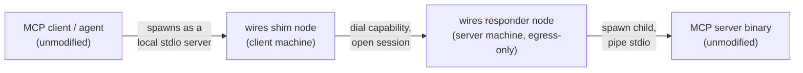
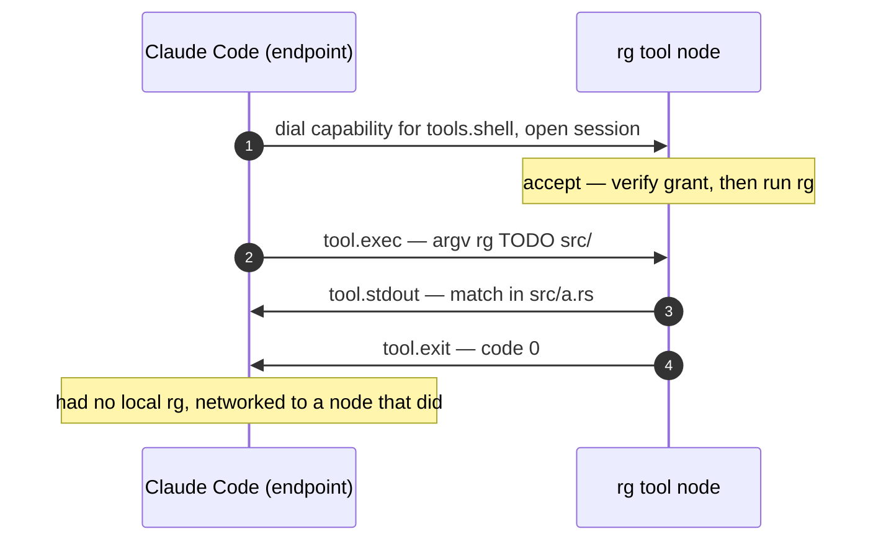

# wires

> **Your agents get a private, end-to-end-encrypted group chat — with each
> other, with your tools, and with you — and any MCP server can be dialed
> into it.**


Two halves run today. The group chat is the newer one — several agents and you
on one encrypted topic, no server in the middle: see
[Topics](#topics-several-agents-and-you-one-conversation). The dial-in half is
the older one, and solves a real problem on its own:

**Run any stdio MCP server on another machine as if it were local.** The
caller's identity is verified before the first byte; access is revocable
without rotating a single key. No OAuth bolt-on, no bearer token pasted into a
config file, no inbound port on the server. Point your MCP client at
`wires connect`, point `wires serve` at the unmodified server binary, and
neither side knows a network is involved — see
[MCP over wires](#mcp-over-wires-flow-b--no-extra-code) for the two-command
setup, or [Usage](#usage) for the full walkthrough.

## Quickstart: run the demos

Two unattended scripts stand the whole thing up on loopback — three keystores,
a committed roster, a responder wrapped around an **unmodified** stdio MCP
server, and a real MCP conversation across it. Each asserts its own result, so
a green run is a passing test, not a screenshot:

```bash
bazel build //wires
./.scripts/demo-mcp.sh      # an MCP server on "another machine", dialed by ticket
./.scripts/demo-revoke.sh   # revoke → the same dial dies, nothing re-keyed
```

- **`demo-mcp.sh`** (~7 s) — watch the final line. The tool answers with the
  *caller's* node id, which it learned from wires' environment injection, not
  from anything the request claimed. The script asserts that every byte on the
  dialer's stdout parsed as JSON-RPC: no banner, no log line, no framing.
- **`demo-revoke.sh`** (~1 min paced and narrated for a first-time viewer;
  ~7 s under `--quiet`) — watch the responder's pid stay the same across
  the revocation, then watch the identical dial exit `77` with **zero bytes**
  on stdout and the reason printed on the dialer's own terminal. Default
  `--mode roster` advances the signed head; `--mode crl` appends to the
  responder's `crl.json`.

Both take `--quiet` (assertions only) and `--keep` (leave the state dir).
Both provision into a fresh `mktemp -d` and never touch `~/.config/wires`.

The screencast at the top of this file is `demo-revoke.sh` recorded as-is; to
re-record after a change:

```bash
asciinema rec -c ./.scripts/demo-revoke.sh demo.cast && agg demo.cast docs/demo-revoke.gif
```

## Topics: several agents and you, one conversation

Everything above is one client and one server. A **topic** is the other shape:
your agents and you in one encrypted conversation, with no server in the
middle and no account anywhere. You sign a list of who's in; anyone on it can
talk; taking someone out is one command on the machine that holds your key,
and nobody restarts.

Three steps, after the usual `keygen` (see [Usage](#usage)):

```bash
# 1. You, holding the root key: sign the member list. Per member it writes an
#    inclusion proof and that member's sealed copy of the group's data key.
wires roster add --member "$AGENT_ID"
wires roster commit --ttl 3600 --out ./proofs      # prints the head token
wires member --subject "$AGENT_ID" --ttl 3600 > agent.pass

# 2. Each member, once: all four credentials in a single command.
wires import --membership-file ./agent.pass \
             --inclusion-proof-file ./proofs/$AGENT_ID.proof \
             --roster-head "$HEAD" \
             --fabric-key-file ./proofs/$AGENT_ID.key

# 3. Talk. `tail` is the resident node — log, mesh, admission, replay — and
#    prints its own bootstrap ticket on stderr.
wires tail ops                                     # → share to bootstrap: <ticket>
wires publish ops -m "deploying build 41" --peer "$TICKET"
```

The topic isn't created anywhere; both sides compute the same name from the
group they belong to. `publish` on a machine with a running `tail` hands the
text to it over a unix socket; on a cold machine it stands up a one-shot node,
delivers, and exits. Either way the line in the transcript is stamped with the
key that signed it — no display name to spoof — and a member who was offline
catches up from any other member, because every tail serves history.

Two more self-asserting scripts, same rules as above (`--quiet`, `--keep`,
never touch `~/.config/wires`):

```bash
./.scripts/demo-topic.sh          # two agents, one topic, nobody in the middle
./.scripts/demo-topic-revoke.sh   # cut one out mid-conversation; same pid throughout
```

Design, threat model, and the four revocation latencies the second script
asserts: [docs/phase2-topics.md](docs/phase2-topics.md).

## Why you'd want this

Today you give an agent power by *co-locating* tools and secrets next to it:
install binaries in its sandbox, mount API keys into its environment, spawn
MCP servers as local child processes, hand it a shell. The agent can do
whatever happens to sit beside it — which couples capability to location and
spills secrets into the agent's box.

Wires makes a tool something you **dial**, not a binary you bundle. Any
program's stdin/stdout becomes an authenticated, revocable network endpoint.
Harnessing an agent becomes *granting it access*: you issue a
non-transferable, human-rooted grant to reach one specific tool — wherever
that tool actually runs (a VPC, another machine, an air-gapped enclave) — and
the agent holds only that grant, never the tool's secrets. The tool's database
password or API key stays with the tool; revoke the grant and the agent loses
the tool, with no key rotation and nothing to re-image.

It is `ssh user@host -- tool`, but the address is a grant instead of an IP,
the credential is bound to the caller's identity instead of being a copyable
key, and the far end is one scoped tool instead of a whole shell. Your
existing CLIs and MCP servers work unmodified, because the session's native
payload *is* stdio (and, one frame up, MCP).

Because access is granted *to your network* rather than configured *into each
service*, the result is data sovereignty that survives switching agents or
platforms. Services join your network; you don't join each service. Switch
LLM providers and grant the new agent access to the same tools the old one
had — your house, your data, and your services don't need to be reconnected.
Lock-in becomes a property of whom you chose to grant access, not of any
single service's data hoard.

## Where this is going

MCP is a superb tool protocol and keeps narrowing itself into an even better
one — one client, one server, request/response. What it leaves permanently
out of scope is *communication*: several agents and a human sharing context,
an agent noticing something and telling the others, push, persistence,
identity that travels with you. Filling that gap — the group chat, built on
the membership and revocation machinery that already runs here — is the
product; its minimum ships today as [Topics](#topics-several-agents-and-you-one-conversation),
CLI-only. Next is the on-ramp in the other direction, so an agent joins a
topic through its own MCP config instead of a terminal. The plan, its
reasoning, its phase gates, and its kill criteria live
in [docs/restart.md](docs/restart.md); the layer model underneath is the
[thesis](#wires-as-a-session-layer-stdio-and-mcp-over-a-capability-addressed-network)
at the bottom of this file.

## Setup dev environment

First, we recommend you setup a Bazel-based developer environment with homebrew.

1. Run `make setup`

This will install `bazelisk` and `direnv` and add all the bazel-controlled tools to the path in this directory.

## Usage

> **Status:** the design is implemented end-to-end — the `library` core
> (identity, grants, **fabric membership**, tickets, policy, the session frame
> codec), the `wires` multi-call binary (`keygen` / `grant` / `member` /
> `roster` / `revoke` / `import` / `pair` / `serve` / `connect`), a self-hosted
> `relay`, distroless OCI images, an on-disk keystore, direct-address tickets,
> and offline revocation that lands on the next dial without a restart.
> Every session also proves **fabric membership** and hands the verified caller
> identity to the served tool (see
> [Fabric membership](#fabric-membership-identity-on-every-session) and the
> companion [docs/fabric-vision.md](docs/fabric-vision.md)). What's left is
> convention, not plumbing: a standardized stdio-frame vocabulary (see the thesis
> at the bottom).

### Layout

Three flat Bazel packages in one Cargo workspace (build & test are Bazel-only —
`bazel build //...`, `bazel test //...`; see [CLAUDE.md](CLAUDE.md) and
[docs/rust-bazel-layout.md](docs/rust-bazel-layout.md)):

- **`//library`** — the `library` crate: the pure, transport-free core — identity,
  grant, ticket, policy, and the session `Frame` codec. No iroh/tokio; property +
  unit + doctested.
- **`//wires`** — the multi-call binary: the whole layer surface as subcommands.
  The iroh transport (`wires/transport.rs`), keystore (`wires/keystore.rs`), and
  pairing (`wires/pair.rs`) live here so `library` stays pure.
- **`//relay`** — a self-hosted [`iroh-relay`](https://docs.rs/iroh-relay)
  rendezvous server.

Both binaries also build as distroless OCI images — `//wires:image` and
`//relay:image` (`bazel run //relay:image.load` to `docker load`).

### Build and test

Everything goes through Bazel (see [CLAUDE.md](CLAUDE.md) for the dependency
workflow — never `cargo build`/`cargo test`):

```bash
bazel build //...          # build the library + binaries
bazel test  //...          # unit + property + doctests + the loopback QUIC test
bazel run   //wires -- --help
```

Run a subcommand with `bazel run //wires -- <subcommand> …`, or build once and
call the binary directly at `bazel-bin/wires/wires`.

For production deployment — containers, Kubernetes manifests, and self-hosting
the relay — see [docs/deployment.md](docs/deployment.md); for the test suite and
manual recipes see [docs/testing.md](docs/testing.md).

**Try it locally in two terminals.** `.scripts/serve-rg.sh` provisions demo keys,
boots a responder running `rg`, and mints a ticket; `.scripts/connect.sh` pipes
its stdin over wires to that `rg` and prints the matches. Both log to stderr so
you can watch the handshake and session:

```bash
./.scripts/serve-rg.sh                                   # terminal 1
printf 'a\nTODO: ship it\nb\n' | ./.scripts/connect.sh   # terminal 2 → "2:TODO: ship it"
```

These two keep their state in a sticky `$WIRES_DEMO_DIR` (default
`/tmp/wires-demo`) so you can re-dial without re-provisioning. The unattended
[quickstart demos](#quickstart-run-the-demos) use a fresh `mktemp -d` instead.
Every script in `.scripts/` runs directly from the repo root, not via
`bazel run //.scripts:…`.

### The command surface

| Command          | Role                      | What it does                                                                 |
| ---------------- | ------------------------- | ---------------------------------------------------------------------------- |
| `wires keygen`   | trust-root / host setup   | Generate (or re-derive) a **node key** and **root key**; print, and `--save-*` to the keystore |
| `wires grant`    | trust root (the human)    | Root-sign a capability and emit a base64 **ticket**, optionally with `--addr`/`--relay-url` hints |
| `wires member`   | trust root (the human)    | Root-sign a **fabric membership** for a node and emit a base64 token (`--save` to the keystore) |
| `wires roster`   | trust root (the human)    | Author a **committed roster**: `add`/`remove` members, `commit` a signed head + per-member proofs, `head` to print the current head token |
| `wires revoke`   | trust root / responder    | Add a subject to the CRL (keystore `crl.json` by default) and print it       |
| `wires import`   | anyone receiving creds    | Install a membership / inclusion proof / roster head / topic data key into the keystore, so later commands need no flags |
| `wires tail`     | any member (resident)     | Own a **topic**: the message log, the mesh, the admission gate, the replay server, and a control socket; print the transcript and its own bootstrap ticket |
| `wires publish`  | any member                | Put a message on a topic — through a running `tail`'s socket, or as a one-shot node when there isn't one |
| `wires serve`    | responder (the tool host) | Verify the dialer's **membership** (and, with `--scope`, a matching grant), exec a command, bridge its stdio — injecting the verified caller identity into the child |
| `wires connect`  | dialer (the agent side)   | Present the **membership** and dial a `--ticket` (scoped) or `--target` (inclusion-only), piping local stdin/stdout/stderr |
| `wires pair`     | operator ⇄ requester      | Issue a grant over the wire: `accept` (operator consents) ⇄ `request` (node)  |

### Two keys

There are two Ed25519 keys with different jobs (see the design notes below):

- **Node key** — a node's iroh transport identity. Its public half *is* the
  node id you dial. Every participant (the responder host and each dialer) has
  one.
- **Root key** — the human trust root that signs grants. Its public node id is
  what a responder is told to `--trust-root`. It never touches iroh.

`keygen` emits both as `<label> <hex>` lines:

```bash
$ bazel run -q //wires -- keygen
node_seed 0202…0202   # 32-byte Ed25519 seed (secret) for the node key
node_id   8139…b394   # the node's public id — what others dial
root_seed 0101…0101   # secret seed for the root signing key
root_id   8a88…6f5c   # the trust-root id others verify against
```

Pass `--node-seed <hex>` / `--root-seed <hex>` to re-derive deterministically
instead of generating fresh keys.

### The keystore

So you don't paste private keys into every command (where they leak via `ps`,
shell history, and — for `serve`, which execs a child — the child's
environment), keys and the CRL live in a **keystore** directory, resolved as
`$WIRES_HOME`, else `$XDG_CONFIG_HOME/wires`, else `~/.config/wires`:

| File              | Written by           | Read by                          |
| ----------------- | -------------------- | -------------------------------- |
| `node.seed`       | `keygen --save-node` | `serve` / `connect` node key     |
| `root.seed`       | `keygen --save-root` | `grant` / `member` signing key   |
| `crl.json`        | `revoke` (default)   | `serve` revocation check         |
| `membership.json` | `member --save` / `import` | `connect` + `serve` fabric membership |
| `roster.json`        | `roster add`/`commit` | the root's full member set (`0600`, private) |
| `roster-head.json`   | `roster commit` / `import` | `serve` (the signed head it enforces, public) |
| `inclusion-proof.json` | `import`            | `connect` (the member's own proof, public) |

`keygen --save-node` / `--save-root` write `0600` seed files (refusing to
clobber unless `--force`). On the tool host you save the node key; on the
operator's machine you save the root key:

```bash
# tool host / agent box:
bazel run -q //wires -- keygen --save-node      # writes ~/.config/wires/node.seed
# operator's machine (keep this one safe):
bazel run -q //wires -- keygen --save-root      # writes ~/.config/wires/root.seed
```

Every secret/CRL input resolves in the same order: **inline flag → environment
variable → `--…-file <path>` → keystore**. So with the keystore populated, the
commands below need no seed at all — and for Kubernetes you mount a `Secret` and
point at it with `--node-seed-file /etc/wires/node.seed` (the `--…-file` forms
exist for exactly that). The dialer's membership resolves the same way
(`--membership <token>` → `$WIRES_MEMBERSHIP` → `--membership-file` →
`membership.json`); unlike the seeds it is a *public* credential (mode `0644`).

### End-to-end: drive a remote `rg` over wires (Flow A)

Three roles, which may be three machines. Each saves its key to its own
keystore, so only the public **ids** (and the ticket) cross machines.

**1. The human mints the trust root** on their own machine (keep it safe):

```bash
bazel run -q //wires -- keygen --save-root   # note ROOT_ID; root.seed stays here
```

**2. Each host/agent makes and saves a node key:**

```bash
bazel run -q //wires -- keygen --save-node   # on the tool host → note SERVER_ID
bazel run -q //wires -- keygen --save-node   # on the agent box → note AGENT_ID
```

**3. The human admits the agent to the fabric and grants it the tool.** First a
**membership** — the agent's scope-independent fabric identity, required on every
session (explained [below](#fabric-membership-identity-on-every-session)) — then
a scoped **grant**. Both are root-signed; the root key comes from the keystore,
so no `--root-seed` is needed. These print a membership **token** and a
capability **ticket** (the address):

```bash
MEMBERSHIP=$(bazel run -q //wires -- member \
  --subject "$AGENT_ID" \
  --ttl     3600)

SERVER_MEMBERSHIP=$(bazel run -q //wires -- member \
  --subject "$SERVER_ID" \
  --ttl     3600)

TICKET=$(bazel run -q //wires -- grant \
  --subject "$AGENT_ID" \
  --target  "$SERVER_ID" \
  --scope   tools.rg \
  --ttl     3600)
```

Use `--not-after <unix>` instead of `--ttl` for an absolute expiry.

The **responder needs a membership too**: inclusion is mutual, and `serve`
presents its own in the handshake ack so a ticket-less dialer can verify the
service it just reached. Install it on the tool host before starting `serve`:

```bash
bazel run -q //wires -- import --membership "$SERVER_MEMBERSHIP"   # on the tool host
```

**4. The tool host serves the scope**, exec-scoped to one command, egress-only
(no inbound port). The node key comes from the keystore. A session is accepted
only if the caller presents a valid **membership** (signed by `--trust-root`,
for the authenticated caller, unexpired, not revoked) **and** a matching grant
(same root, subject equals the caller, scope matches, valid TTL, not revoked):

```bash
bazel run -q //wires -- serve \
  --trust-root "$ROOT_ID" \
  --scope      tools.rg \
  -- rg --line-number TODO
```

Everything after `--` is the child command (program + args) exec'd per session.

**5. The agent installs its membership once**, with `wires import`. After this
the dial takes no flags but the ticket — which is exactly what makes `wires
connect` droppable into an MCP client config:

```bash
bazel run -q //wires -- import --membership "$MEMBERSHIP"
# → wrote ~/.config/wires/membership.json
```

**6. The agent dials the capability** — exactly like running a local stdio
program. It presents the installed membership and the ticket; its node key
comes from the keystore; its stdin is forwarded to the child; the child's
stdout/stderr stream back; its exit code becomes `connect`'s:

```bash
echo "search input" | bazel run -q //wires -- connect --ticket "$TICKET"
```

The dialer's node key **must** be both the membership's member and the grant's
subject (`AGENT_ID`) — the responder checks that the iroh-authenticated caller
equals each, so neither can be used by anyone else. The served `rg` is handed the
verified caller in its environment (`WIRES_CALLER_NODE` / `WIRES_FABRIC_ROOT`),
so a tool can authorize per caller with no extra round-trip. (If you'd rather not
use the keystore, every command also accepts secrets inline via `--node-seed` /
`--root-seed`, via `$WIRES_NODE_SEED` / `$WIRES_ROOT_SEED`, or from a file via
`--node-seed-file` / `--root-seed-file`; the membership likewise via
`--membership` / `$WIRES_MEMBERSHIP` / `--membership-file` — `import` just
writes the keystore copy for you so the dial stays flagless.)

### Fabric membership: identity on every session

A **grant** authorizes one scope; a **membership** answers a different question —
*"is this node part of my fabric, and who is it?"* — independent of any tool. The
human mints one per node with `wires member` (root-signed, non-transferable,
offline-verifiable against the pinned `--trust-root`), and the dialer presents it
on **every** session. A membership is a *public* credential: pass it inline with
`--membership`, via `$WIRES_MEMBERSHIP` / `--membership-file`, or save it to the
keystore as `membership.json`.

```bash
# The human (holds the root key) admits a node to the fabric:
bazel run -q //wires -- member --subject "$AGENT_ID" --ttl 3600
```

It buys two things:

- **Verified identity delivered to the tool, with no extra round-trip.** Once a
  responder verifies the membership it injects the verified caller into the
  child's environment — `WIRES_CALLER_NODE` (the iroh-authenticated peer),
  `WIRES_FABRIC_ROOT` (the responder's own trust root), and
  `WIRES_MEMBERSHIP_NOT_AFTER`. The served binary finally learns *who* is driving
  it. These are server-derived, never a dialer claim, and any inherited `WIRES_*`
  is scrubbed before the child starts.
- **Inclusion-only responders.** Run `serve` *without* `--scope` (and with the
  explicit `--allow-any-member`) and any fabric member may open a session; the
  served binary authorizes from the injected identity. This is the enterprise-MCP
  shape — one responder, per-caller authorization in the tool itself:

  ```bash
  bazel run -q //wires -- serve --trust-root "$ROOT_ID" --allow-any-member \
    -- my-mcp-server --config /etc/my-mcp.toml
  ```

  Without `--scope` *and* without `--allow-any-member`, `serve` refuses to start:
  execing for any member is an intentional authorization downgrade that must be
  asked for.

Membership is **slice 1** of a larger plan (committed rosters, then
delegation/federation) — see [docs/fabric-vision.md](docs/fabric-vision.md) and
[docs/provable-fabric-inclusion.md](docs/provable-fabric-inclusion.md).

### Committed roster: current membership + fabric-wide revocation

A membership says the root vouched for a node *at issue time* (bounded by its
TTL). The **committed roster** adds *current* membership: the root keeps a
versioned member set and signs a tiny 32-byte **head** (a Merkle root) whenever
it changes; a verifier holding the latest head checks a caller's **inclusion
proof** against it, offline, and learns *present* membership. Removing a member
and re-signing is fabric-wide revocation with no CRL to distribute. The head
leaks nothing about the set; a proof reveals only its holder's id and `O(log n)`
sibling hashes. This is **slice 2b** — see
[docs/committed-roster.md](docs/committed-roster.md); head/proof distribution
(gossip, sealed blobs, a blind node) is the deferred slice 2c.

```bash
# The human authors the roster (offline) and signs a head + per-member proofs.
bazel run -q //wires -- roster add --member "$MEMBER_ID"
bazel run -q //wires -- roster add --member "$SVC_ID"      # the service is a member too
bazel run -q //wires -- roster commit --ttl 3600 --out ./proofs
# → writes keystore roster-head.json, prints the head token, and emits
#   ./proofs/<node-id>.proof for each member.

# The same human mints each side's membership and copies the head out:
bazel run -q //wires -- member --subject "$SVC_ID"    --ttl 3600 >./svc-membership
bazel run -q //wires -- member --subject "$MEMBER_ID" --ttl 3600 >./member-membership
bazel run -q //wires -- roster head                                >./roster-head

# Each side installs what it needs, once, with `import` (no hand-copying into
# membership.json / inclusion-proof.json). On the service:
bazel run -q //wires -- import \
  --membership-file ./svc-membership \
  --inclusion-proof-file "./proofs/$SVC_ID.proof" \
  --roster-head-file ./roster-head
# On the member:
bazel run -q //wires -- import \
  --membership-file ./member-membership \
  --inclusion-proof-file "./proofs/$MEMBER_ID.proof"

# The service enforces the head it just installed (any member with a valid
# current proof may connect):
bazel run -q //wires -- serve --trust-root "$ROOT_ID" --allow-any-member \
  -- sh -c 'echo "caller=$WIRES_CALLER_NODE roster=$WIRES_ROSTER_VERSION"'

# The member dials — membership and proof come from its keystore:
bazel run -q //wires -- connect --target "$SVC_ID"
# → the child sees WIRES_CALLER_NODE and the WIRES_ROSTER_VERSION that admitted it.
```

Now `roster remove --member "$MEMBER_ID" && roster commit` and the *same* dial
is rejected — on the **next connection**, with no responder restart, because
`serve` re-reads `roster-head.json` per connection. The removed member is never
issued a newer proof: revocation here is omission, not a blocklist entry. Run
`./.scripts/demo-revoke.sh` to watch it happen end to end.

A commit bumps the version and therefore invalidates *every* member's proof,
including the service's own — so a head advance means re-distributing one small
proof per remaining member alongside the new head.

A ticket-less (`--target`) dialer also verifies the **responder's** membership
from the handshake ack before sending any stdin — *mutual inclusion*, so the
agent never streams to a service outside its fabric.

### MCP over wires (Flow B) — no extra code

`serve` doesn't care whether the child is `rg` or an MCP server. Point `serve` at
your MCP server binary, and configure the MCP **client** to spawn `wires connect`
as its stdio server command. wires carries the JSON-RPC bytes opaquely.

On the server machine (e.g. inside a VPC; its secrets stay local):

```bash
bazel run -q //wires -- serve \
  --trust-root "$ROOT_ID" --scope mcp.myserver \
  -- my-mcp-server --config /etc/my-mcp.toml
```

On the agent machine, install the credentials once and put `wires` on `PATH`:

```bash
bazel run -q //wires -- import --membership "$MEMBERSHIP"
# and, if the responder enforces a roster head:
#   --inclusion-proof-file ./proofs/$AGENT_ID.proof

bazel build -c opt //wires && cp bazel-bin/wires/wires ~/.local/bin/wires
```

Copy, don't symlink: `bazel-bin/` is itself a symlink into the Bazel cache and
moves on `bazel clean`.

Then in the MCP client config, replace the local command with the dialer. After
the `import` above, the ticket is the *only* argument it needs:

```json
{
  "mcpServers": {
    "myserver": {
      "command": "wires",
      "args": ["connect", "--ticket", "<TICKET>"]
    }
  }
}
```

**GUI clients need absolute paths.** Claude Desktop (and anything else launched
from the Dock/Finder rather than a shell) spawns servers with a minimal `PATH`
and without your shell's environment — use `"command":
"/Users/you/.local/bin/wires"`. It also won't have `$XDG_CONFIG_HOME` set, so
the keystore it reads is `~/.config/wires`; run the `import` as the same user
the client runs as.

The client believes it launched a local stdio server; the server believes it was
launched locally. Neither knows a network is involved. (For a multi-tenant MCP
server, run the responder
[inclusion-only](#fabric-membership-identity-on-every-session) with
`--allow-any-member` and authorize each caller inside the server from
`WIRES_CALLER_NODE`.)

#### Verified against MCP 2026-07-28

wires is a byte-transparent stdio bridge: it never parses, rewrites, or buffers
JSON-RPC. What the [2026-07-28
rev](https://modelcontextprotocol.io/specification/2026-07-28) requires of a
*stdio server* is therefore a property of the bridge, not of the protocol. Each
of these was measured on a live session against this tree — reproduce with
`./.scripts/demo-mcp.sh`:

- **stdout carries only the server's bytes.** A captured session's stdout
  parsed line-for-line as JSON-RPC with nothing else in it; every failure path
  wrote zero bytes. `demo-mcp.sh` and `demo-revoke.sh` both assert this, and it
  is what makes the bridge safe to drop into a `command` field at all.
- **all diagnostics go to stderr** — wires' own logging, the remote child's
  stderr (forwarded back over the session), and denial reasons.
- **exit codes are meaningful.** The remote child's exit code becomes
  `connect`'s; a local or transport failure is `1`; an authorization refusal is
  **77**, with `wires: denied by responder: <reason>` on stderr.
- **full duplex before EOF.** Five `ping`s were issued one at a time on a single
  open session, each with a 400 ms pause and stdin never closed: first
  round trip ~34 ms, steady state ~3 ms on loopback. A long-lived client session
  behaves as if it had spawned the server locally, rather than as a batch pipe.
- **one child per session.** Two sequential dials against one responder exec'd
  two distinct child pids, and a dialer that disappears has its remote child
  killed rather than orphaned (covered by a test in `wires/transport.rs`).

Protocol-level features of the rev — stateless requests, the per-request
protocol version and client capabilities in `_meta`, `resultType` — ride through
untouched; conformance to *those* belongs to whatever MCP server you put behind
`wires serve`, not to wires. The bundled `.scripts/fake-mcp-server.py` exercises
them so the demos have something honest to talk to: it answers `tools/call` with
no prior `initialize` (stateless), returns a deterministic single-item
`tools/list`, stamps `resultType: "complete"` and
`io.modelcontextprotocol/serverInfo` on every result, and echoes the request's
protocol version back in the result's `_meta`.

Two caveats, stated plainly:

- The canonical request key is `io.modelcontextprotocol/protocolVersion`
  (camelCase), confirmed against the published spec's "Per-request protocol
  fields" table. The fake server *also* accepts
  `io.modelcontextprotocol/protocol-version`, `protocolVersion`, and
  `protocol-version` so hand-typed demo JSON still round-trips; only the first
  spelling is normative.
- A real MCP client has been driven against the bridge (2026-08-13): a
  headless Claude Code session (`claude -p --mcp-config …`) given only the
  config block above completed the full MCP handshake through
  `wires connect`, called the demo tool, and reported the responder-verified
  caller id. After a roster head-advance — responder not restarted — the
  identical session no longer saw the server at all: `wires connect` exited
  `77` at the handshake with zero bytes on stdout, so from the client's side
  the tool simply ceased to exist. Re-admitting the member (new commit +
  `wires import` of the fresh proof) restored it, same ticket and all.

### Pairing: issue a grant over the wire

`grant` requires pasting the subject's node id. `pair` collects it over an
authenticated channel instead: the requester dials the operator and announces a
scope; the operator consents and mints a ticket whose **subject is the
requester's iroh-authenticated node id** — so a paired ticket is
non-transferable by construction.

```bash
# Operator (holds the root key): listen, auto-consent once. Logs its node id +
# bound sockets so the requester knows where to dial.
bazel run -q //wires -- pair accept \
  --target "$SERVER_ID" --scope tools.rg --ttl 3600 --yes --once

# Requester (the agent box): dial the operator directly, print the issued ticket.
TICKET=$(bazel run -q //wires -- pair request \
  --operator "$OPERATOR_ID" --addr 198.51.100.9:4433 --scope tools.rg)
```

Drop `--yes` to be prompted per request (`grant '<scope>' to <node id>? [y/N]`),
and `--once` to keep serving. The operator reaches requesters / the requester
reaches the operator the same way as everywhere else — direct `--addr`,
`--relay-url`, or n0 discovery.

### Revocation (offline)

Revocation is offline — no auth server, no token introspection endpoint. On the
tool host, `revoke` updates the keystore's `crl.json` in place, and `serve`
reads it by default, so revoking a subject is a one-liner:

```bash
# serve reads ~/.config/wires/crl.json automatically:
bazel run -q //wires -- serve --trust-root "$ROOT_ID" --scope tools.rg -- rg --line-number TODO

# ...and in another terminal, append a subject to that crl.json (idempotent):
bazel run -q //wires -- revoke --subject "$AGENT_ID"
```

**It takes effect on the next dial, with no responder restart.** `serve`
re-reads both `crl.json` and `roster-head.json` once per connection, so
`wires revoke` and `roster commit` land immediately; a session already open is
deliberately unaffected. A refused dial prints one line on the *dialer's*
stderr — `wires: denied by responder: membership rejected: revoked` — writes
zero bytes to stdout, and exits **77**. (Short TTLs remain worth setting, as
defense in depth for a responder you cannot reach.)

A responder started *before* any head was imported is not stuck at "no
enforcement": the keystore's `roster-head.json` is checked for on every
connection, so the first dial after `wires import --roster-head …` is the first
one gated on inclusion. (`--roster-head <token>` and `$WIRES_ROSTER_HEAD` are
the exception — an inline head is pinned for the process's life by definition.)

Caveat: once a responder has seen a head, *deleting* its `roster-head.json`
fails closed — every subsequent dial is denied with `responder configuration
error` until the file is restored.

The [committed roster](#committed-roster-current-membership--fabric-wide-revocation)
is the stronger of the two stories: instead of adding an id to a blocklist that
every responder must receive, the operator re-signs a head that simply omits the
member, and no newer inclusion proof will ever exist for them — revocation by
omission. `./.scripts/demo-revoke.sh` scripts both paths (`--mode roster`, the
default, and `--mode crl`).

To manage the CRL elsewhere (e.g. a Kubernetes ConfigMap mounted at a path),
`revoke --crl-file <path>` updates that file in place and `serve --crl-file
<path>` reads it; `--crl-json <literal>` is a one-shot transform printed to
stdout.

### Reachability: relays and direct addresses

By default `connect` resolves the target by node id via iroh's n0 discovery +
relays (needs outbound internet). Two ways to avoid that:

- **Self-hosted relay** — run the `relay` binary and point both ends at it with
  `--relay-url http://relay-host:3340` (see [docs/deployment.md](docs/deployment.md)).
- **Direct addresses in the ticket** — at grant time, embed where the responder
  is reachable so the dialer needs *no* discovery at all:

  ```bash
  bazel run -q //wires -- grant --subject "$AGENT_ID" --target "$SERVER_ID" \
    --scope tools.rg --ttl 3600 \
    --addr 198.51.100.7:4433 --relay-url http://relay-host:3340
  ```

  `--addr` (repeatable) and `--relay-url` are baked into the ticket. They are
  *unsigned hints*: iroh still authenticates the peer to the target's key, so a
  wrong address can only fail to connect, never impersonate. `serve` logs its
  node id and bound sockets at startup to help you fill these in.

### Other current limits

- **Discovery without hints:** a hintless ticket (no `--addr`) still relies on
  n0 DNS to resolve a node id to an address.
- **Scope is exact-match:** a grant's scope must equal the responder's `--scope`.
- **stdio framing is raw bytes:** the richer `tool.exec`/`tool.stdout` frame
  vocabulary in the thesis below is still a convention to build, not shipped.

# Wires as a session layer: stdio and MCP over a capability-addressed network

The clever core of wires is one idea: **a capability-addressed transport
whose native protocol data unit is stdio — and, one frame up, MCP.** This
document is just that idea and the two reference protocols that sit on it
(stdio-over-wires and MCP-over-wires).

> **Status.** The layer itself is built (see [Usage](#usage) above): the
> capability-addressed transport, the human-rooted grant model, and the
> dial-a-capability-get-a-stdio-session ALPN all run today on iroh. What remains
> *conceptual* is the richer reference **protocol** — the `tool.exec` /
> `tool.stdout` frame vocabulary below — which is a convention on the layer; the
> shipped bridge moves raw stdio bytes.

## The thesis

Every networking layer is defined by two choices: **what is the address,
and what is the protocol data unit (PDU).** Those two answers are what
make TCP "TCP" and HTTP "HTTP". For wires:

- **The address is a capability**, not an `(IP, port)`. You do not dial a
  *host*; you dial *a tool you have been granted the right to use*,
  identified by key and scoped by a non-transferable, human-issued grant.
- **The PDU is a stdio stream** (stdin / stdout / stderr / exit), and one
  frame up, an MCP message. The link's *native* content is exactly what
  agents and tools already speak.

That second choice is the move. Most systems treat stdio and MCP as
*application payload you happen to ship over a generic transport*. Wires
makes them the **native framing of a link layer**, so "networking a tool"
and "speaking to a tool" become the same act — there is no impedance
mismatch to bridge, because the wire already speaks pipes.

The one-line form:

> **Wires is the missing session layer of the agent stack: a
> capability-addressed, identity-bound transport whose native PDU is
> stdio and MCP. It makes any binary's stdin/stdout a first-class,
> location-independent network endpoint usable only by whoever you grant —
> turning "provision the tool next to the agent" into "dial the tool by
> capability, wherever it runs."**

## Where it sits in the stack

Walk the existing stack and the gap is precise:


| Layer                 | Address             | Credential                               | What you get                             | Gap for agent tooling                                   |
| ----------------------- | --------------------- | ------------------------------------------ | ------------------------------------------ | --------------------------------------------------------- |
| TCP/IP                | `(IP, port)`        | none                                     | byte pipe                                | no identity, location-bound                             |
| TLS                   | `(IP, port)` + cert | CA chain                                 | encrypted byte pipe                      | identity bolted on, still location-bound                |
| SSH                   | reachable IP        | copyable keypair (bearer)                | authenticated remote shell               | coarse (a whole shell), bearer auth, needs reachability |
| WireGuard / Tailscale | overlay IP          | device key                               | an IP network                            | still L3 — you then run protocols on top               |
| **wires**             | **a capability**    | **non-transferable, human-issued grant** | **an authenticated stdio / MCP session** | — this is the layer                                    |

Nothing above wires lets you say: *"this binary's stdin/stdout is now a
first-class network endpoint, addressable by a capability, reachable
wherever it runs, usable only by whoever I admitted."* That sentence is
the layer. It is SSH where the address is a capability instead of an IP,
the credential is an identity-bound grant instead of a copyable key, and
the far end is a scoped tool instead of a shell.

## The core: dial a capability, get a stream, speak stdio

The novel part wires actually has to add is small. iroh already provides
dial-by-key, NAT-traversing, encrypted, multiplexed QUIC streams. On top
of that, the session layer is:

> **an ALPN meaning "open a capability-scoped stdio/MCP session," plus
> the human-rooted, non-transferable capability model that decides who
> may dial what.**

A tool call is a **session**, not a broadcast: open → stream
stdin/stdout/stderr → close. It needs no persisted log, message broker, or
retention — just a direct, encrypted stream between the two endpoints.


The binary is unchanged and unaware of wires. It reads stdin and writes
stdout/stderr exactly as always. The wrapper node is the adapter between
"process I/O" and "the session," and it owns the only new thing: an
identity, and the capability that says which channel/peer may drive it.

## Reference protocol 1: stdio-over-wires

A stdio tool node maps process I/O directly onto the session. The frames
(this is the *reference convention*, not part of the layer):


| Direction     | Process concept | Frame                                                          |
| --------------- | ----------------- | ---------------------------------------------------------------- |
| agent → tool | argv + stdin    | `tool.exec` (argv, optional stdin) / `tool.stdin` (more input) |
| tool → agent | stdout          | `tool.stdout` (chunk)                                          |
| tool → agent | stderr          | `tool.stderr` (chunk)                                          |
| tool → agent | exit code       | `tool.exit` (code)                                             |

Three interaction shapes fall out of the same session primitive:

- **One-shot** (`rg`, `git status`): one `tool.exec` in; a few
  `tool.stdout`/`tool.stderr` frames and a `tool.exit` out; stream closes.
- **Streaming** (`tail -f`, a build with progress): the tool keeps
  emitting `tool.stdout` as output arrives; the agent sees it live.
- **Interactive / long-running** (a REPL, a shell-like session): the
  agent feeds further `tool.stdin` while the process stays alive; a
  correlation id ties a stream of frames to one process instance.

Because CLIs are self-documenting, discovery needs no registry: an agent
dials the tool and runs `--help` to learn the surface, then uses it
directly. The project intends to publish a standard stdio-over-wires
frame format so tools and agents interoperate without negotiating — a
convention on the layer, not part of it.

## Reference protocol 2: MCP-over-wires

This is the cleanest proof the thesis sits at the right layer. An MCP
server is normally a **local binary** that the MCP client spawns as a
child process and talks to over stdio (JSON-RPC framed on stdin/stdout).
Because the wires session's native PDU *is* stdio, you can relocate that
binary to another machine and **MCP never notices** — no remote-transport
story to invent, no HTTP/SSE/OAuth bolt-on.

### What actually runs on each machine

Two thin wires nodes bracket the existing, unmodified pieces. Nothing
about the MCP client or the MCP server changes.


- On the **server machine** (e.g. inside a VPC): a wires **responder**
  node. It holds an identity and an installed grant, binds an iroh
  endpoint (egress-only, dialable by key, *no inbound port*), and listens
  on the session ALPN. On an inbound capability-scoped session it verifies
  the caller's grant, spawns the MCP server binary as a child process, and
  bridges the iroh stream byte-for-byte to the child's stdin/stdout/stderr.
- On the **client machine** (where the agent runs): a wires **shim** node.
  The MCP client spawns it exactly as it would spawn a local stdio MCP
  server. The shim holds the capability to dial the remote, opens a
  session, and pipes its own stdin/stdout to the iroh stream.

The MCP client believes it launched a local stdio server; the MCP server
believes it was launched locally by a client. Neither is aware of the
network between them. wires carries the JSON-RPC bytes opaquely — it never
parses MCP.

### What has to exist on the server machine

- the **MCP server binary** and everything it needs to do its job
  *locally* — its config and its secrets. The database password, API key,
  or service credential an MCP server uses **stays on that machine and
  never travels to the agent**; the agent only ever holds a capability to
  *reach* the server, not the secrets the server wields.
- the **wires responder binary** with a grant installed (issued once via
  the pairing flow).
- **outbound network egress** to reach a relay / rendezvous. No inbound
  ports, no public endpoint, no TLS certificate, no MCP-side auth layer.

### Why this is the right framing

This is essentially `ssh user@host -- mcp-server`, with the three
differences that make it a *layer* rather than a workaround: the address
is a **capability** instead of a reachable IP, the credential is a
**non-transferable identity-bound grant** instead of a copyable key, and
the exposure is scoped to **exactly that one binary** instead of a shell.
Your "local" MCP server now runs in a VPC, an air-gapped enclave, or on
another machine — and the MCP spec did not change at all.

MCP-over-wires as described here carries  an MCP *server's* stdio across
the session layer — and is the conceptual reference protocol, not a
shipped component.

## Agents like Claude Code are just endpoints

An agent is not special transport; it is another endpoint on the layer.
Claude Code stops being the box that *contains* its tools and becomes a
peer that **dials tools by capability.** Its right to drive a tool is the
grant it holds, not shell access, not a bundled binary, not an API key in
its environment.


## What the layer gives you for free

These are properties of the session layer itself — the agent and the tool
implement none of them:

- **Identity on every session.** The session is authenticated to the caller's
  key, and the caller proves **fabric membership**; the responder hands that
  verified identity to the served tool as environment variables
  (`WIRES_CALLER_NODE` / `WIRES_FABRIC_ROOT`). The tool knows *which* endpoint is
  driving it, cryptographically — never "whoever reached the socket."
- **Authorization is the address.** You can only dial a capability you
  hold. There is no separate auth layer in the tool; its access policy
  *is* who you granted the capability to.
- **Non-transferable, human-issued grants.** Authority is bound to an
  endpoint's key and rooted in one human's key. It cannot be copied or
  subleased the way an SSH key or API token can.
- **Instant revocation.** Withdraw the grant and the endpoint can no
  longer dial. No key rotation across every place a secret was cached.
- **End-to-end encryption + NAT traversal**, inherited from iroh: the
  tool is reachable egress-only, with no public endpoint, and the stream
  is encrypted between the two endpoints.
- **Multi-party as session fan-out.** Several agents — and a human
  watching — can attach to one tool session as additional observers of the
  same stream.

## Layer vs. convention

To keep the line clear:

- **Layer (the invention):** capability addressing, identity-bound
  non-transferable grants, the dial-a-capability-get-a-stdio-session
  ALPN, end-to-end encryption and NAT traversal via iroh.
- **Reference protocols (conventions on the layer):** the stdio-over-wires
  frame vocabulary (`tool.exec` / `tool.stdout` / `tool.stderr` /
  `tool.exit`, correlation ids), and MCP-over-wires (MCP's own JSON-RPC
  carried byte-for-byte on a stdio session). Two endpoints may negotiate
  something else; the layer does not care what flows on the session.

The point of the split is that you build identity, capability
authorization, encryption, and NAT traversal **once**, as a layer — and
then "make any stdin/stdout a secure, networked, revocable endpoint" and
"make a local MCP server remote" are both *reference protocols on that
layer*, not new protocols.
