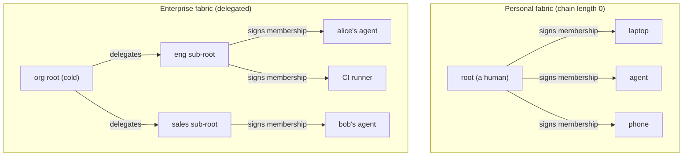

# The fabric: provable membership over the wires layer

The [README](../README.md) makes wires' thesis precise: a **capability-addressed
transport whose native PDU is stdio**. The address is a capability, the
credential is a non-transferable human-issued grant, and a tool call is an
authenticated session. That layer is built.

This document is the companion thesis for the part the layer *implies* but does
not yet make first-class: the **fabric** — the graph of nodes one trust root
vouches for — and the ability for any participant to **prove membership in it
offline, non-interactively**, so that a tool learns *who* is driving it the
instant the session opens, with no extra round-trip.

> **Status.** This is a design north-star, not shipped code. The first concrete
> step — a root-signed membership credential — is specified in
> [provable-fabric-inclusion.md](./provable-fabric-inclusion.md). The next — the
> **committed roster** (its data structure, offline verification, and local
> wiring) — is specified in [committed-roster.md](./committed-roster.md); the
> roster's *distribution* (gossip head, sealed blobs, blind node) and the
> federation layer described below remain **deferred** and are called out as such.

## Where the gap is

The README's "what the layer gives you for free" already promises *identity on
every session*: "the tool knows which endpoint is driving it, cryptographically."
Two things keep that promise from being fully real today:

1. **The served binary can't actually see the caller.** `serve` authenticates the
   dialer to its key and then execs a child over piped stdio — but it never tells
   the child *who* it authenticated. An MCP server behind `serve` knows it was
   spawned; it does not know which fabric member is on the other end.
2. **There is no notion of *membership* distinct from a per-scope grant.** A node
   is "in" only in the sense that it happens to hold some `Grant{subject, scope,
   not_after}`. There is no scope-independent, durable answer to "is this node a
   member of my fabric, and who is it?" — the question an identity-aware tool
   actually wants to ask.

Closing (1) and (2) is what turns "a pile of grants" into a **fabric**.

## The one primitive

Inclusion is a credential signed by an **authority**, which a verifier trusts
because either:

- it **is** the pinned root the verifier was configured with (a *personal*
  fabric — chain length 0), or
- a **delegation chain** leads back to that pinned root (an *enterprise* fabric).

A personal fabric is the **degenerate case of the enterprise one**: same
credential, same verification, the chain is just empty. We get to design the
personal experience and the enterprise experience as one mechanism with a knob,
not two systems.

## Two concerns the word "membership" smuggles together

The reason a naïve "publish the member list" design feels right for a household
and wrong for a company is that *membership* bundles two separable concerns:

| Concern | Question | Where it lives |
|---|---|---|
| **Inclusion proof** | "Is this a legitimate member?" | Offline, non-interactive, **identical** for personal & enterprise. A signed credential answers it. |
| **Revocation / freshness** | "Is this member *still* current, right now?" | Where the two worlds **diverge.** The classic CRL / OCSP / short-lived-cert tradeoff: offline + instant revocation are in tension. |

Separate them, and the architecture falls out. The inclusion proof is the
universal base (and the whole of the first slice). The revocation strategy is a
*layer on top*, and there are two good ones for two different worlds.

## Two deferred layers, one credential

### Committed roster — the personal-fabric strategy

> The credential, the signed head, the Merkle inclusion proof, and offline
> verification are specified in [committed-roster.md](./committed-roster.md)
> (slice 2b). The *distribution* described in this section — gossip for the head,
> sealed blobs for the full set, and the blind persistence node — is the deferred
> follow-on (slice 2c).

A single cold root, a small set (a human's handful of devices and agents). The
root keeps a **versioned commitment** to the member set and re-signs it when
membership changes; a verifier checks a member's inclusion against the latest
commitment, and revocation is just re-signing without the departed member. The
root also gets **enumeration** — "show me everything in my fabric."

The naïve framing — "publish the signed member list" — hides two questions worth
separating.

**What is committed, and is it confidential?** A flat signed list leaks the whole
membership to anyone who can verify it — the org-chart leak, now at personal
scale. So the commitment is a **Merkle root**: the head is a 32-byte hash that
reveals nothing, a member proves inclusion with a path without exposing the
others, and the *full* set lives only in a blob **sealed to a fabric epoch key**
(the blind-host + epoch-key model `main` already built), readable by members and
the root alone. Merkle earns its place here for **confidentiality**, not compact
proofs — a clean split between a **public signed head** (leaks nothing) and an
**encrypted full-set blob** (confidential).

**Where does the head live, and how do verifiers learn it?** This is the part an
earlier draft hand-waved. The answer leans on iroh intrinsics plus one
reintroduced piece of infrastructure — three jobs, one primitive each:

- **iroh-blobs — the immutable content.** A roster snapshot is a content-addressed
  blob; its BLAKE3 hash *is* its name and self-verifies its bytes, so any party can
  serve it and integrity is independent of who did (and the bytes are sealed, so a
  server learns nothing).
- **iroh-gossip — the mutable pointer.** Content-addressing has a chicken-and-egg:
  fetching "the latest roster" needs its hash, but the hash changes each version.
  So the fabric has a gossip topic (derived from the fabric id) onto which the root
  publishes a tiny signed head — `(fabric, version, blob_hash, not_after, sig)`.
  Nodes adopt the highest version they see; gossip does propagation, blobs do
  content + integrity.
- **A blind always-on fabric node — persistence + availability.** The root is
  cold/occasional, so *something* must stay awake to hold the latest head and pin
  the blobs when the root and most members are offline. This node holds **no keys**:
  it can only relay and persist root-signed heads and sealed, content-addressed
  blobs — it cannot forge a roster or read one. It is the spiritual return of
  `main`'s `wires-host`, scoped to signed/sealed persistence rather than
  message-log retention, reusing the same blindness contract (persist what you
  cannot forge or read; everything served is independently verifiable).

The headline capability stays intact: a verifier never hits the node in the hot
path. It syncs the current head from gossip in the background and verifies a
caller's presented inclusion proof **offline** against the head it holds.

This shape is not new crypto. It is **Certificate Transparency's signed tree head
+ gossip + a log mirror**: the roster is a transparency log of membership, the head
is an STH, gossip is the anti-split-view mechanism, the blind node is a mirror.

**The residual risk is freshness, not forgery.** The node is zero-trust for
integrity — it cannot fabricate membership or roster state — but it *can* withhold
an update or serve a stale-but-validly-signed head to suppress a revocation. The
mitigations are CT's: monotonic versions (a verifier who has seen version *V*
rejects *V−1*), a `not_after` in the signed head so stale heads self-expire, and
gossip's multi-path propagation making an eclipse hard. A bounded, well-understood
price for the persistence convenience.

**Reintroducing a node is a deliberate choice, not a regression.** Removing the
always-on host was necessary to find wires' first principles — to prove the core
(offline-verifiable, non-transferable credentials) needs no server. Having proven
that, we add a *blind* node back for one specific job — persistence and revocation
freshness — eyes open, rather than sliding into a trusted server. Two
sub-questions stay open: whether this is the **same box** as the `relay` (one
always-on host doing both rendezvous and blind persistence) or a separate role,
and whether it is **per-fabric or multi-fabric** (as `wires-host` was).

### Delegation / federation — the enterprise strategy

A single flat roster is the *wrong* tool for a company, for three concrete
reasons:

- **Single signer.** Enterprises delegate — org → department → team — and are
  often fed by an existing IdP (Okta, Entra). One key signing the whole list is
  an organizational mismatch.
- **Hot key.** Constant churn (hires, departures, contractors) means re-signing
  constantly, which forces the root key online — throwing away the cold-root
  security that made the model attractive.
- **Org-chart leak.** A global, verifiable member list hands the entire org chart
  to anyone who can verify it.

Enterprises reach instead for **federation + short TTLs**: the org root (cold)
signs *delegations* to issuing authorities (hot, IdP-adjacent); those authorities
mint **short-lived** membership credentials; a verifier checks them offline
against the pinned org root by walking the `authority_chain`; revocation is
simply *stop renewing* a departed member. This is how SPIFFE/SVID and OIDC
already work at enterprise scale — present a short-lived signed identity, verify
offline, no roster. It is also where **federated identity claims** (org, role,
email) naturally attach to the credential.

Both layers are additions to the **same** credential — one whose authority is
either the pinned root or a chain back to it. We build the credential once; the
roster and the chain are non-breaking extensions behind an explicit version.

## The capability this unlocks

> An MCP server behind `wires serve` learns the **verified identity of its
> caller** with **no additional network traffic.**

The caller presents its membership credential in the session handshake; the
responder verifies it offline against a pinned fabric root (no callback to an
identity server); and the responder hands the verified identity to the served
binary. For a personal fabric that's "my agent, on my fabric." For an enterprise
fabric — once federation lands — that's "alice@corp, role=engineer, vouched for
by the eng sub-root under the org root," delivered to an unmodified MCP server as
data it can authorize on. That is the difference between *the agent stack as it is
configured today* (co-located tools, ambient trust, bearer tokens) and a tool
that **knows who it is talking to** before it does any work.

## Roadmap

| Slice | Adds | Revocation | Status |
|---|---|---|---|
| **1 — Provable inclusion** | Root-signed `Membership` credential; verified caller identity passed to the served child via env vars | CRL + short TTL | **Specified** ([spec](./provable-fabric-inclusion.md)) |
| **2 — Personal fabric** | Pairing issues memberships; committed roster (Merkle head via gossip, sealed full set via blobs, blind persistence node) + enumeration | Re-signed roster head | Roster **specified** ([spec](./committed-roster.md)); pairing + distribution deferred |
| **3 — Federation** | `authority_chain` delegation; federated identity claims (org, role, email) | Short-TTL renewal | Deferred |

Each slice is buildable on its own and leaves the credential wire-format
forward-compatible for the next (see the versioning discipline in the spec).

## Relationship to `main`

An earlier line of work (the `main` branch) attacked membership **bottom-up** —
gossip, epoch keys, hash-chained per-topic logs, channel rosters, a blind relay.
Its primitives are individually sound, but it never produced a *non-interactive,
offline membership proof*, and its revocation story (local CRL flags with no
fabric-wide propagation, no epoch rotation on membership change) was incomplete.
This line inverts the approach: start from James's **top-down capability model**,
which already has the right primitive — a root-signed, offline-verifiable,
non-transferable credential — and grow the fabric on it. `main` will be
**archived as the initial proof of concept**; its lessons (what a sound
membership proof must guarantee, where revocation actually bites) are folded into
this design.
