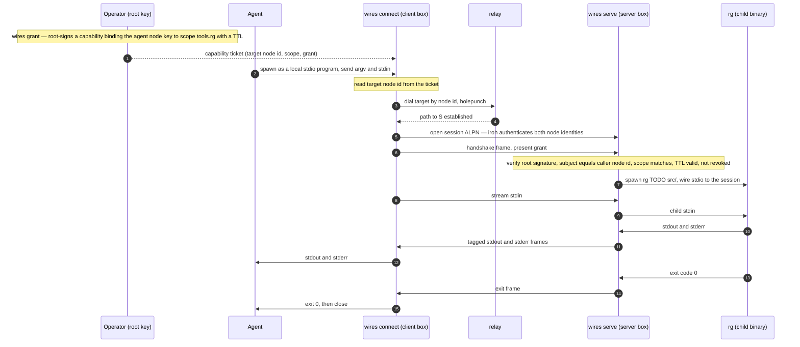
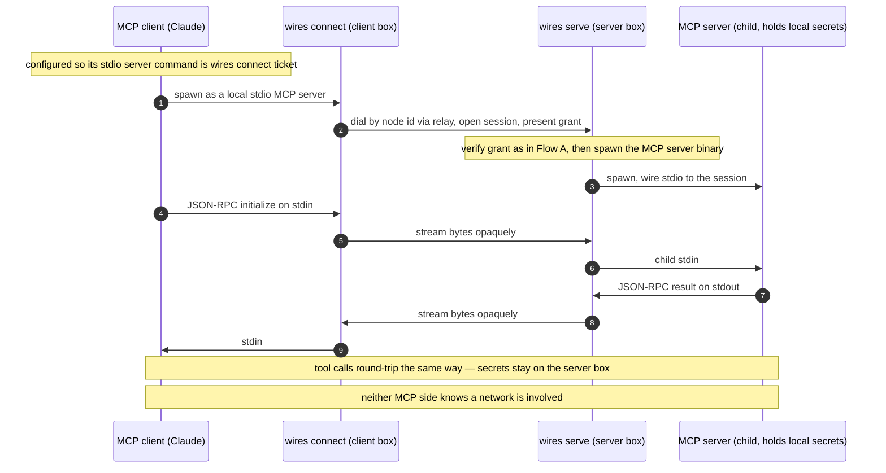

### Binaries for the wires session-layer core

## Context

`../README.md` argues the *real* invention in wires is one
thing: **a capability-addressed transport whose native PDU is stdio (and,
one frame up, MCP).** The address is a capability, not `(IP, port)`; the
credential is a non-transferable, human-issued grant; and "networking a
tool" and "speaking to a tool" become the same act.

This document answers: *if we started from scratch, keeping only iroh, what
binaries would we actually build to support that core?* It deliberately
discards the existing Rust/iOS code.

What iroh already gives us, and we therefore do not rebuild:
dial-by-public-key, NAT traversal / holepunch, encrypted multiplexed QUIC
streams, custom ALPN protocols, cryptographically authenticated peer node
identity on every connection, and discovery (pkarr/DNS + mDNS). The relay
*implementation* also ships in iroh; we only wrap/operate it.

Decisions taken:

- **Packaging:** one multi-call `wires` binary with subcommands.
- **Rendezvous:** rely on iroh built-ins *and* offer a self-hosted relay.
- **Revocation:** offline — grant TTL + a responder-side allowlist / CRL.
  No always-on revocation service.

Net result: **two binaries.**

## Realized layout

Built as flat top-level Bazel packages in one Cargo workspace (hand-written
`# gazelle:ignore` BUILD files; see `CLAUDE.md`):

- **`//library`** — the `library` crate; holds the shared mechanics below.
- **`//src:wires`** — the multi-call `wires` binary.
- **`//relay`** — the self-hosted relay binary.

Build & test are Bazel-only (`bazel build //...`, `bazel test //...`); the
`Cargo.lock` that `rules_rs` reads is refreshed with the Bazel-vendored cargo.

**Status.** The `//library` core (identity, grant, ticket, policy) is
implemented and tested (property + unit + doctests). The `//src:wires`
subcommands and `//relay` are still scaffolding stubs that print
"not implemented" — wiring them to `//library`, the `session` protocol, and the
iroh transport are the upcoming phases.

## The binaries

### 1. `wires` — the entire layer surface (multi-call)

One executable, role-distinct subcommands.

**Trust-root / admin (the human's side)**

- `wires keygen` — generate two distinct keys (see **Cryptographic
  material** below): the **node key** (the iroh transport identity —
  forced to Ed25519) and the **root key** (signs grants — algorithm is our
  choice, so it can be brought from a hardware token, the Secure Enclave,
  an HSM, etc.). Supports importing/seed-deriving the node key rather than
  generating it fresh.
- `wires grant` — mint a **capability**: root-signs a grant binding a
  specific *subject node pubkey* to a *scope* (a named tool/endpoint +
  permitted use) with a `not_after` TTL. Emits a base64 **capability
  ticket** = target node id (the responder's iroh identity) + scope +
  grant. This *is* the address.
- `wires revoke` — append a node/grant id to the responder's CRL (offline
  revocation; pairs with short TTLs).
- `wires pair` — operator side of pairing when node and operator are
  separate: the node announces its node pubkey + requested scope; the
  operator consents and returns a sealed, root-signed grant. (UX wrapper
  around `grant`.)

**Server side — the responder (`wires serve`)**

- Binds an iroh endpoint, listens on the session ALPN (egress-only, *no
  inbound port*). Per inbound connection: iroh has already authenticated
  the caller's node id → verify the presented grant (root signature chains
  to the trusted root, subject == authenticated caller node id, scope
  matches, TTL valid, not in CRL). On success: spawn the configured
  command as a child and **bridge the stream byte-for-byte to the child's
  stdin/stdout/stderr + exit code**. This is `sshd`, but capability-scoped
  and exec-scoped to one binary.

**Client side — the dialer (`wires connect`)**

- Presents a **local stdio interface**: an agent or MCP client spawns it
  exactly as it would spawn a local stdio program. Resolves the target
  node id from the capability ticket, dials via iroh, opens a session,
  presents its grant, then pipes its own stdin/stdout ⇄ the stream.
  Ephemeral — one process per session. This is the `ssh` client.

**MCP-over-wires needs no extra code:** `serve` runs the MCP server binary
as its child; the MCP client is configured to use `wires connect` as its
stdio server command. wires carries the JSON-RPC bytes opaquely.

### 2. `relay` — self-hosted rendezvous

A thin wrapper over iroh's relay server, for private / air-gapped networks
that don't want to depend on n0's public relays. Provides holepunch
coordination (and optionally a discovery anchor) so two egress-only nodes
with no inbound reachability can still connect.

### Shared mechanics (conceptual, used by every subcommand)

These live in the `//library` crate as modules; ✅ = implemented, ⏳ = pending.

- ✅ **identity** (`library/identity.rs`) — Ed25519 `NodeIdentity`; `NodeId` /
  `Signature` newtypes; generate / sign / verify. See **Cryptographic material** below.
- ✅ **grant / capability** (`library/grant.rs`) — root-signed, bound to a subject
  node key, scoped, TTL'd, and carrying an **algorithm id** so the responder knows
  how to verify it; non-transferability enforced because the subject must equal the
  iroh-authenticated peer on the connection.
- ✅ **ticket** (`library/ticket.rs`) — the base64 `CapabilityTicket` (target + scope
  + grant) that *is* the address a dialer presents.
- ✅ **policy** (`library/policy.rs`) — TTL + CRL/allowlist checked at accept time.
- ⏳ **session protocol** (`library/session.rs`) — a session ALPN, a handshake frame
  that presents and verifies the grant, then a tagged stdio framing
  (`stdin | stdout | stderr | exit`) over the iroh bi-stream. (Types only so far; the
  framing + transport land with the iroh phase.)

### Cryptographic material

There are two keys with very different constraints, because **iroh only
ever sees the node key — it never sees the root key.**

**Node key — iroh dictates it.** iroh's node identity *is* an Ed25519
keypair: `SecretKey` is Ed25519, the `NodeId` is the 32-byte Ed25519
public key, the QUIC/TLS handshake authenticates the peer to that key
(this is the "iroh authenticates both node identities" step in the flows),
and pkarr discovery signs its DHT/DNS records with the same key. So there
is **no algorithm alternative** for the node key. What a user *can* bring
is the bytes: import an existing Ed25519 secret, or deterministically
derive it from a seed/mnemonic (e.g. SLIP-0010) so one held seed
regenerates every node key.

> **Gotcha:** the Apple Secure Enclave can only hold non-extractable
> **P-256** keys — it cannot store an Ed25519 key. So an iroh node key
> can't be a Secure-Enclave key; it lives in the Keychain or a file.

**Root key — our construct, so bring almost anything.** The root key's
only job is to sign grants that `wires serve` verifies in application code;
iroh has no idea it exists. So the user has full freedom of scheme:

- **P-256 / ECDSA** — which *can* be a non-extractable Secure Enclave key
  unlocked by Face ID (the natural choice for an iOS-held root).
- **A hardware token** — YubiKey/PIV, OpenPGP card, any PKCS#11/FIDO signer.
- **An HSM / cloud KMS**, an **air-gapped offline signer**, or a
  **threshold / MPC** scheme ("N-of-M of my devices co-sign a grant").
- **Ed25519** as the zero-config default.

The only cost of this freedom is the grant's **algorithm id** + the
responder recording which scheme its `--trust-root` uses.

**No separate encryption key needed.** The old substrate kept an x25519
key to seal grants offline; here the session is already
encrypted+authenticated by iroh, so grants travel over an authenticated
`wires pair` session. If sealing-at-rest is ever wanted, derive an X25519
key from the Ed25519 node key rather than storing another key.

## End-to-end flows

### Flow A — stdio-over-wires (the spine): an agent drives `rg` on a remote box

What the binaries are doing: `wires grant` is the trust root minting an
address. `wires connect` is a dumb pipe that turns "a local stdio program"
into "a dialed capability." `wires serve` is the gatekeeper-plus-exec: it
proves the caller is allowed (using the node identity iroh already
authenticated), runs the real binary, and shuttles bytes. `relay`
only helps the two endpoints find a path; it sees ciphertext.

### Flow B — MCP-over-wires: a local MCP server, run remotely, unchanged

What the binaries are doing: identical to Flow A — same `connect`, same
`serve`, same grant verification. The *only* differences are which binary
`serve` execs (an MCP server instead of `rg`) and that the MCP client is
the thing spawning `connect`. wires never parses MCP; it moves the
JSON-RPC bytes the same way it moved `rg`'s stdout. This sameness is the
proof the layer is at the right level.
