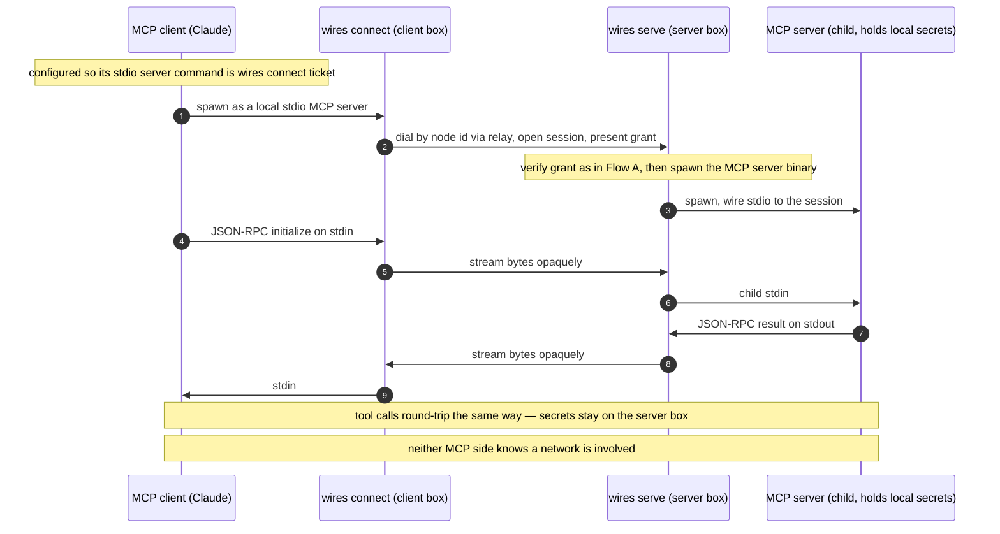

# Ab-initio binaries for the wires session-layer core

## Context

`docs/tools-over-wires.md` argues the *real* invention in wires is one
thing: **a capability-addressed transport whose native PDU is stdio (and,
one frame up, MCP).** The address is a capability, not `(IP, port)`; the
credential is a non-transferable, human-issued grant; and "networking a
tool" and "speaking to a tool" become the same act.

This document answers: *if we started tabula rasa, keeping only iroh, what
binaries would we actually build to support that core?* It deliberately
discards the existing Rust/iOS code.

What iroh already gives us, and we therefore do not rebuild:
dial-by-public-key, NAT traversal / holepunch, encrypted multiplexed QUIC
streams, custom ALPN protocols, cryptographically authenticated peer node
identity on every connection, and discovery (pkarr/DNS + mDNS). The relay
*implementation* also ships in iroh; we only wrap/operate it.

Decisions taken:
- **Packaging:** one multi-call `wires` binary with subcommands.
- **Rendezvous:** rely on iroh built-ins *and* offer a self-hosted relay.
- **Revocation:** offline — grant TTL + a responder-side allowlist / CRL.
  No always-on revocation service.

Net result: **two binaries.**

## The binaries

### 1. `wires` — the entire layer surface (multi-call)

One executable, role-distinct subcommands.

**Trust-root / admin (the human's side)**
- `wires keygen` — generate the root identity key and node identity keys.
- `wires grant` — mint a **capability**: root-signs a grant binding a
  specific *subject node pubkey* to a *scope* (a named tool/endpoint +
  permitted use) with a `not_after` TTL. Emits a base64 **capability
  ticket** = target node id (the responder's iroh identity) + scope +
  grant. This *is* the address.
- `wires revoke` — append a node/grant id to the responder's CRL (offline
  revocation; pairs with short TTLs).
- `wires pair` — operator side of pairing when node and operator are
  separate: the node announces its node pubkey + requested scope; the
  operator consents and returns a sealed, root-signed grant. (UX wrapper
  around `grant`.)

**Server side — the responder (`wires serve`)**
- Binds an iroh endpoint, listens on the session ALPN (egress-only, *no
  inbound port*). Per inbound connection: iroh has already authenticated
  the caller's node id → verify the presented grant (root signature chains
  to the trusted root, subject == authenticated caller node id, scope
  matches, TTL valid, not in CRL). On success: spawn the configured
  command as a child and **bridge the stream byte-for-byte to the child's
  stdin/stdout/stderr + exit code**. This is `sshd`, but capability-scoped
  and exec-scoped to one binary.

**Client side — the dialer (`wires connect`)**
- Presents a **local stdio interface**: an agent or MCP client spawns it
  exactly as it would spawn a local stdio program. Resolves the target
  node id from the capability ticket, dials via iroh, opens a session,
  presents its grant, then pipes its own stdin/stdout ⇄ the stream.
  Ephemeral — one process per session. This is the `ssh` client.

**MCP-over-wires needs no extra code:** `serve` runs the MCP server binary
as its child; the MCP client is configured to use `wires connect` as its
stdio server command. wires carries the JSON-RPC bytes opaquely.

### 2. `wires-relay` — self-hosted rendezvous

A thin wrapper over iroh's relay server, for private / air-gapped networks
that don't want to depend on n0's public relays. Provides holepunch
coordination (and optionally a discovery anchor) so two egress-only nodes
with no inbound reachability can still connect.

### Shared mechanics (conceptual, used by every subcommand)

- **identity** — ed25519 node + root keys.
- **grant / capability** — root-signed, bound to a subject node key,
  scoped, TTL'd; non-transferability enforced because the subject must
  equal the iroh-authenticated peer on the connection.
- **session protocol** — a session ALPN, a handshake frame that presents
  and verifies the grant, then a tagged stdio framing
  (`stdin | stdout | stderr | exit`) over the iroh bi-stream.
- **policy** — TTL + CRL/allowlist checked at accept time.

## End-to-end flows

### Flow A — stdio-over-wires (the spine): an agent drives `rg` on a remote box

What the binaries are doing: `wires grant` is the trust root minting an
address. `wires connect` is a dumb pipe that turns "a local stdio program"
into "a dialed capability." `wires serve` is the gatekeeper-plus-exec: it
proves the caller is allowed (using the node identity iroh already
authenticated), runs the real binary, and shuttles bytes. `wires-relay`
only helps the two endpoints find a path; it sees ciphertext.

### Flow B — MCP-over-wires: a local MCP server, run remotely, unchanged

What the binaries are doing: identical to Flow A — same `connect`, same
`serve`, same grant verification. The *only* differences are which binary
`serve` execs (an MCP server instead of `rg`) and that the MCP client is
the thing spawning `connect`. wires never parses MCP; it moves the
JSON-RPC bytes the same way it moved `rg`'s stdout. This sameness is the
proof the layer is at the right level.
